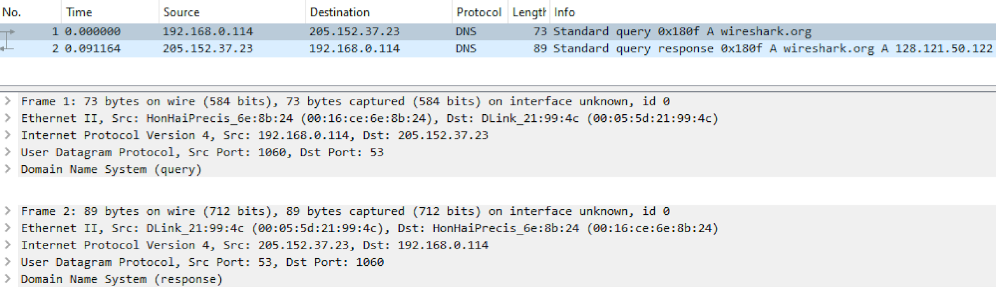
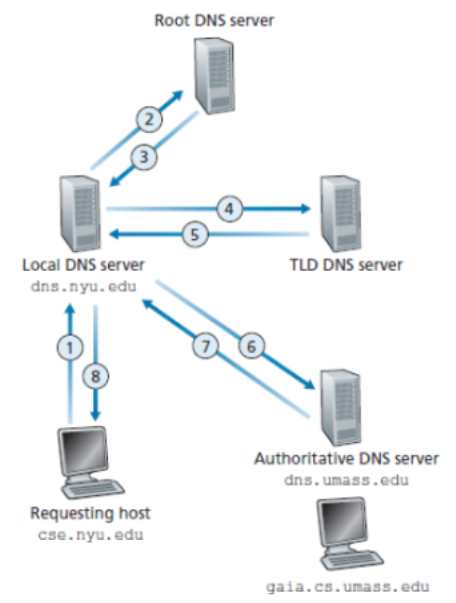

# Guia 1: Nivel de Aplicación

Redes de Comunicaciones (TB067) - 2C2024 - FIUBA  
Martin Klöckner - [mklockner@fi.uba.ar](mailto:mklockner@fi.uba.ar)

\vspace{1em}

> 1. Para una sesión de comunicación entre un par de procesos, ¿qué proceso es
>    el cliente y cuál es el servidor?

El proceso cliente es aquel que inicia la comunicación entre un par de procesos,
mientra que el proceso servidor es aquel que espera a que otro proceso inicié la
comunicación. 

> 2. Para una aplicación de intercambio de archivos P2P, ¿está de acuerdo con la
>    afirmación: “No existe la noción de los lados cliente y servidor de una
>    sesión de comunicación”? ¿Por qué o por qué no?

No sé está de acuerdo, ya que existe la noción de cliente y servidor en una
sesión de transferencia de archivos P2P, solo que cualquier proceso puede
ser servidor o cliente, es decir, cualquier proceso puede iniciar la
comunicación con otro, o esperar a que otro proceso inicie la comunicación.

> 3. ¿Qué es un "socket"?

Un "socket" es un conjunto de datos que permite la comunicación entre dos
procesos. Cuando se establece una conexión entre dos procesos, cada proceso debe
asignar un socket a esa comunicación. La estructura del socket queda
determinada por los procesos que se intentan conectar.

En el modelo TCP/IP, se habla de un socket de internet, el cual permite la
comunicación entre dos procesos, por lo general pertenecientes a computadoras
distintas. Los sockets de internet se identifican por su numero de socket, el
cual se crea a partir de el protocolo de transporte utilizado en la
comunicación, la dirección IP de fuente y destino y el el número de puerto local
y de destino.

> 4. Mencione una aplicación que requiera que no haya pérdida de datos y que
>    también sea extremadamente sensible al tiempo.

Un ejemplo puede ser el protocolo SMTP utilizado para la comunicación de correos
electrónicos, en este caso es extremadamente importante que no ocurra perdida de
datos, ya que pueden transportar información sensible y/o importante; en cuanto
al tiempo no es tan importante ya los usuarios pueden permitirse que se demore
unos segundos.

Existen diversos ejemplos siendo la mayoría correspondiente a servicios
interactivos en tiempo real, como la telefonía por internet (VoIP), las
teleconferencias, o los juegos multijugador.

> 5. ¿Cuáles son algunas diferencias entre TCP y UDP?

La principal diferencia entre TCP y UDP es que TCP es más confiable ya que es
mas robusto debido a varios mecanismos que lo diferencian de UDP y que lo hacen
mas seguro, por ejemplo el proceso de 3 pasos que se utiliza en TCP para
iniciar una sesión, o el procedimiento 

> 6. ¿Por qué TCP y UDP no tienen mecanismos de cifrado?

Porque son protocolos relativamente viejos, los cuales en un principio no
estaban pensados en términos de seguridad, y eran relativamente simples.

Esta falencia se logró compensar con otro protocolo denominado Transport Layer
Security (TLS) el cual permite el cifrado de la comunicación a través de una
red. 

> 7. ¿Por qué HTTP, SMTP e IMAP se ejecutan sobre TCP en lugar de UDP?

Porque son protocolos que requieren que no haya perdida de datos. En el caso de
SMTP o IMAP que se utilizan para la transmisión de correo electrónicos, la
perdida de datos implicaría perdida de la información, la cual puede ser
importante.

> 8. ¿Cuál es la diferencia entre una conexión HTTP persistente y una conexión
>    no persistente?

La diferencia radica en que la conexión HTTP persistente una vez finalizada la
transferencia de datos continua esperando por datos del usuario hasta que se
termine el tiempo de conexión, mientras que la conexión HTTP no persistente
termina una vez finalizada la transferencia.

> 9. ¿El almacenamiento en caché web reducirá la demora para todos los objetos
>    solicitados por un usuario o solo para algunos de los objetos? ¿Por qué?
>    ¿En qué casos un almacenamiento en caché web no mejora el tiempo de
>    respuesta?

El almacenamiento en caché web (también llamado servidor proxy) siempre reduce
la demora en la carga de archivos, ya que por lo general están mas cerca de los
usuarios; en tal caso se evita la transferencia desde el servidor, que por lo
general suele estar mas lejos al cliente.

Puede que la copia de datos almacenada en el servidor caché sea obsoleta con
respecto a los datos del servidor, en ese caso el servidor caché tendrá que
obtener los datos desde el servidor, y en ese caso existe una demora mayor que
si no hubiera servidor caché.

> 10. La siguiente cadena de caracteres ASCII ha sido capturada por Wireshark
>     cuando el navegador enviaba un mensaje GET HTTP. Responda a las siguientes
>     cuestiones, indicando en qué parte del siguiente mensaje GET HTTP se
>     encuentra la respuesta.
>     a. ¿Cuál es el URL del documento solicitado por el navegador?
>     b. ¿Qué versión de HTTP se está ejecutando en el navegador?
>     c. ¿Qué tipo de conexión solicita el navegador, persistente o no
>        persistente?
>     d. ¿Cuál es la dirección IP del host en el que se está ejecutando el
>        navegador?
>     e. ¿Qué tipo de navegador inicia este mensaje? ¿Por qué es necesario
>        indicar el tipo de navegador en un mensaje de solicitud HTTP?  
>     ```
>     GET /cs453/index.html HTTP/1.1<cr><lf>
>     Host: gaia.cs.umass.edu<cr><lf>
>     User-Agent: Mozilla/5.0 (Windows;U; Windows NT 5.1; en-US; rv:1.7.2)
>     Gecko/20040804 Netscape/7.2 (ax)<cr><lf>
>     Accept:ext/xml, application/xml, application/xhtml+xml, text/html;q=0.9,
>     text/plain;q=0.8, > image/png,*/*;q=0.5<cr><lf>
>     Accept-Language: en-us,en;q=0.5<cr><lf>
>     Accept-Encoding: zip,deflate<cr><lf>
>     Accept-Charset: ISO-8859-1,utf-8;q=0.7,*;q=0.7<cr><lf>
>     Keep-Alive: 300<cr><lf>
>     Connection:keep-alive<cr><lf><cr><lf>
>     ```

a. La URL del documento solicitado se compone de un protocolo junto con el
   nombre de host completo, en este caso el protocolo es HTTP y el nombre del
   host se puede obtner de la seccion `Host` del encabezado, teniendo todo esto
   en cuenta la URL resultante es `http://gaia.cs.umass.edu/cs453/index.html`
b. El navegador está ejecutando la version `1.1` de HTTP, esto se puede ver en
   la sección `GET /cs453/index.html HTTP/1.1`. En esta version de HTTP es
   obligatorio incluir el campo `Host` en el encabezado, como se puede ver.
c. El navegador solicita una conexión de tipo persistente, la cual es la
   acción por defecto del protocolo HTTP. Esto se puede ver en la ultima linea del
   encabezado la cual indica: `Connection:keep-alive`.
d. La dirección IP del host en que se esta ejecutan el navegador no se puede
   sabe ya que no se indica en el encabezado HTTP.
e. El tipo de navegador se puede ver en la parte `User-Agent` del encabezado
   HTTP, en este caso es el navegador Netscape version 7.2 de escritorio, en
   particular corriendo sobre el sistema operativo Windows NT 5.1; `Mozilla/5.0`
   indica que es compatible con ese navegador, y se incluye por razones
   históricas.

> 11. El siguiente texto muestra la respuesta devuelta por el servidor al mensaje
>     de solicitud GET HTTP del problema anterior. Responda a las siguientes
>     cuestiones, indicando en qué parte del siguiente mensaje se encuentran las
>     respuestas.
>     a. ¿Ha podido el servidor encontrar el documento? ¿En qué momento se
>     suministró la respuesta con el documento?
>     b. ¿Cuándo fue modificado por última vez el documento?
>     c. ¿Cuántos bytes contiene el documento devuelto?
>     d. ¿Cuáles son los primeros cinco bytes del documento que se está devolviendo?
>     e. ¿Ha acordado el servidor emplear una conexión persistente?  
>     ```
>     HTTP/1.1 200 OK<cr><lf>Date: Tue, 07 Mar 2008 12:39:45GMT<cr><lf>Server:
>     Apache/2.0.52 (Fedora) <cr><lf>Last-Modified: Sat, 10 Dec2005 18:27:46
>     GMT<cr><lf>ETag: ”526c3-f22-a88a4c80”<cr><lf>Accept- Ranges:
>     bytes<cr><lf>Content-Length: 3874<cr><lf> Keep-Alive:
>     timeout=max=100<cr><lf>Connection: Keep-Alive<cr><lf>Content-Type:
>     text/html; charset= ISO-8859-1<cr><lf><cr><lf><!doctype html public ”-
>     //w3c//dtd html 4.0transitional//en”><lf><html><lf> <head><lf> <meta
>     http-equiv=”Content-Type” content=”text/html; charset=iso-8859-1”><lf>
>     <meta name=”GENERATOR” content=”Mozilla/4.79 [en] (Windows NT 5.0; U)
>     Netscape]”><lf> <title>CMPSCI 453 / 591 / NTU-ST550ASpring 2005
>     homepage</title><lf></head><lf> <aquí continúa el texto del documento (no
>     mostrado)>
>     ```

a. Si lo ha podido encontrar ya que el codigo de respuesta es `200 OK`, el
   moemnto en que se suministro la respuesta fue en la fecha `Tue, 07 Mar 2008
   12:39:45 GMT`.
b. El documento recibido por el servidor fue modificado por utilma vez en la
   fecha `Sat, 10 Dec 2005 18:27:46 GMT`, como se puede ver en la seccion
   `Last-Modified` del encabezado.
c. El documento devuelto contiene `3874` bytes, esto se puede ver en la etiqueta
   `Length` del encabezado.
d. Los primeros 5 bytes son `<!doc`, la secuencia `<cr><lf><cr><lf>`` indica el
   termino del encabezado HTTP y luego comienza el documento devuelto
   (recordemos que cada caracter ocupa 1 byte).
e. Si, se puede ver en la etiqueta `Connection:` del encabezado HTTP, la cual
   indica `Keep-Alive`.

<!-- `fix vim syntax -->

> 12. Haga Telnet a un servidor web y envíe un mensaje de solicitud multilínea.
>     Incluya en el mensaje de solicitud la línea de encabezado
>     `If-modified-since:` para forzar un mensaje de respuesta con el código de
>     estado 304 No modificado.

Se accede utilizando telnet al servidor web `www.example.com` en el puerto 80,
de la siguiente manera:

```console
$ telnet www.example.com 80
Connected to example.com.
Escape character is '^]'.
```

Luego se envia un mensaje multilinea de peticion de `index.html` con el codigo
`If-Modified-Since: Wed, 10 Oct 2024 10:00:00 GMT`, con lo cual el servidor
responde

```console
HTTP/1.1 304 Not Modified
Accept-Ranges: bytes
Age: 596825
Cache-Control: max-age=604800
Date: Thu, 17 Oct 2024 16:10:53 GMT
Etag: "3147526947+gzip"
Expires: Thu, 24 Oct 2024 16:10:53 GMT
Last-Modified: Thu, 17 Oct 2019 07:18:26 GMT
Server: ECAcc (mid/871B)
Vary: Accept-Encoding
X-Cache: HIT
```

Notese que se agrega el campo `Host: example.com` ya que este servidor acepta
HTTP versión 1.1 y en esa version es obligatorio este campo.

> 13. La LAN de una universidad tiene una velocidad de transmisión de 100 Mbps.
>     Para acceder a Internet tiene un enlace de acceso cuya velocidad de
>     transmisión es de 10 Mbps. La velocidad media de paquetes es de 20
>     solicitudes / seg. Si cada paquete es de 1Mbit, se pide:
>     a. La velocidad media de los bits en bits/seg.
>     b. La intensidad de tráfico en la LAN.
>     c. La intensidad de tráfico en el enlace de acceso.
>     d. ¿Cómo son las intensidades de tráfico calculadas comparadas con 1? ¿Qué
>        significa esa comparación en términos de retardos?
>     e. Proponga dos soluciones posibles para bajar la intensidad de tráfico en
>        el enlace de acceso.
>     f. Suponga que la universidad instala una caché y que la tasa de acierto
>        es de 0,45. ¿Qué porcentaje de solicitudes serán satisfechas casi de
>        inmediato?¿Qué porcentaje de solicitudes serán satisfechas por los
>        servidores de origen?

a. Por enunciado cada paquete es de `1 Mbit`, y ademas cada solicitud
   corresponde con un pquete, por lo tanto la velocidad emdia resulta:
   \vspace{0.25em}
   $$V_{media} = 1 \nicefrac{Mbit}{Paquete}\cdot 20
   \ \nicefrac{Paquete}{s}\Rightarrow \boxed{V_{media} = 20 \nicefrac{Mbit}{s} =
   20 Mbps}$$
b. La intensidad de trafico se puede calcular mediante la siguiente expresión:
   $$I = \frac{L\cdot a}{V_{trans}} = \frac{V_{media}}{V_{trans}}$$
   \vspace{0.25em}
   Donde $L$ es la longitud de un paquete, $a$, la velocidad media de un
   paquete, $V_{media}$ la velocidad media de los paquetes y $V_{trans}$ la
   velocidad de transmisión de la red LAN. Reemplazando con los valores resulta:
   $$I = \frac{20\ Mbps}{100\ Mbps} \Rightarrow\boxed{I = 0.2}$$
   \vspace{0.25em}
c. Reutilizando la expresion anterior pero reemplazando la velocidad de
   transmisión de la red LAN por la red de acceso resulta:
   $$I = \frac{20\ Mbps}{10\ Mbps} \Rightarrow\boxed{I = 2}$$
d. En el primer caso es menor a 1, mientra que en el segundo caso es mayor. Que
   sea mayor a 1 implica que va a haver un retardo en la transmision de paquetes
   ya que la red no da abasto.
e. Una solución puede ser incrementar la velocidad de transmisión, otra solucion
   puede ser decrementar la longitud de los paquetes, otra solucion tambien
   puede ser implementar un servidor caché.
f. El porcentaje de las solicitudes que serán satisfechas casi de inmediato será
   el 45\% de las solicitudes, el 55\% restante tendran que ser satisfechas por
   los servidores de origen.

> 14. Un cliente HTTP desea recuperar un documento web que se encuentra en un
>     URL dado. Inicialmente, la dirección IP del servidor HTTP es desconocida.
>     ¿Qué protocolos de la capa de aplicación y de la capa de transporte además
>     de HTTP son necesarios en este escenario?

En principio para obtener la direccion IP del servidor HTTP se necesita el
protocolo del nivel de aplicacion DNS, de manera tal que resuelva la URL y
obtenga asi la direccion IP del servidor, luego se necesita un protocolo de la
capa de aplicacion que realice una peticion al servidor HTTP por el archivo, por
ejemplo FTP; el protocolo FTP utiliza el protocolo de transporte TCP para obtner
los archivos del servidor.

> 15. Mencione 3 motivos por los cuales un servidor de DNS no puede ser
>     centralizado.

En principio porque un servidor DNS es critico para resolver la URL de otros
servidores de internet, por lo que ser centralizado implicaria la
**dependencia** de una sola organizacion o servidor central. Otro motivo es la
enorme cantidad de **tráfico** que este servidor centralizado tendria que
manejar. Por ultimo que un servidor sea centralizado implicaria una enorme
perdida de **rendimiento**, ya que cualquier region que quiera acceder a
internet deberia pasar por este servidor centralizado, que puede que esté a una
distancia muy lejana.

> 16. Dada la jerarquía de servidores DNS (Servidores DNS raíz, Servidores de
>     dominio de nivel superior y servidores autoritativos) se pide
>     a. ¿Qué direcciones IP proporcionan cada uno?
>     b. Cuando un host realiza una consulta DNS, ¿a qué tipo de servidor de
>        DNS, que actúa como proxy llega?
>     c. Llamamos R al Servidor DNS raíz, T al Servidor TLD, A al servidor
>        autoritativo, L al servidor local y H al host que realiza la consulta.
>        Suponíamos que el servidor TLD conoce el servidor DNS autoritativo
>        correspondiente al nombre de host. Indique el trayecto del mensaje de
>        consulta desde que el host lo inicia hasta que obtiene la dirección IP
>        del host consultado mediante la letra correspondiente, un guión, la
>        letra siguiente y así sucesivamente.
>     d. ¿Cuántos mensajes DNS se necesitan enviar para obtener la dirección
>        correspondiente a un nombre de host si no se encuentra en el proxy del
>        servidor local y el servidor TLD conoce el servidor DNS autoritativo
>        correspondiente al nombre del host consultado?

a. Supongamos el host `www.example.com`, para resolver la dirección IP de este
   host se comienza a resolver la dirección IP de cada campo separado por punto
   `.` de derecha a izquierda.
   En primer lugar el cliente quien desea hallar la dirección IP del host, hace
   una petición a un servidor DNS raíz por la dirección IP del campo `com`, el
   DNS devuelve las direccionen IP de los servidores DNS de dominio de nivel
   superior (TLD) correspondientes a `com`, luego el cliente hace una nueva
   petición a uno de estos servidores TLD, el cual responde con la dirección IP
   de un servidor DNS autoritativo para el dominio `example.com`, finalmente
   este servidor DNS autoritativo es quien resuelve la dirección IP del host
   `www.example.com`.
b. Cuando un host realiza una consulta DNS, esta se envía al servidor DNS local,
   el cual actúa como proxy. Este servidor DNS local, no pertenece a la
   jerarquía de servidores DNS, si no que cada proveedor de internet (ISP)
   dispone de servidor DNS local.
c. Suponiendo que el servidor TLD conoce el servidor DNS autoritativo
   correspondiente al nombre de host, entonces el mensaje de consulta sigue el
   siguiente trayecto: `H -> L -> R -> T -> A`
d. Se requiere un total de 8 mensajes 4 de petición y 4 respuestas, las

> 17. ¿Cuál es la diferencia entre consultas de DNS iterativas y consultas
>     recursivas?

Una consulta DNS recursiva ocurre cuando un servidor DNS se comunica con otros
servidores DNS para intentar resolver una dirección URL y devolverla al cliente,
en cambio, una consulta DNS iterativa ocurre cuando el cliente se comunica
directamente con cada servidor DNS involucrado en la resolución de la dirección
URL[^1].

Por lo general los clientes realizan consultas iterativas a los servidores DNS y
estos si realizan consultas recursivas para resolver la dirección IP solicitada
por el cliente.

[^1]: [https://www.cloudflare.com/learning/dns/what-is-recursive-dns/](https://www.cloudflare.com/learning/dns/what-is-recursive-dns/)

> 18. Dado que la correspondencia entre el nombre de un host y su dirección IP
>     puede cambiar, ¿cuál es el comportamiento de un servidor de DNS respecto
>     de la información almacenada en su caché DNS para prevenir esto?

Para prevenir esto los servidores DNS descartan la información almacenada en
cache pasado un cierto tiempo, por lo general un par de días.

> 19. Un cliente se conecta a una aplicación de home banking basada en la web
>     mediante protocolo HTTP, el cual no tiene memoria del estado de la
>     conexión. Una vez que inició sesión, ¿cómo identifica el servidor al
>     cliente?

El servidor identifica al cliente mediante el uso de Cookies. Para que un sitio
pueda utilizar Cookies se necesitan 4 cosas:

* Una linea de cabecera de la cookie en el mensaje de respuesta.
* Una línea de cabecera de la cookie en el mensaje de solicitud HTTP.
* El archivo de cookies almacenado en el sistema terminal del usuario y
* gestionado por el navegador del usuario.
* Una base de datos back-end en el sitio web.

> 20. Supongamos que estás realizando un análisis de tráfico de red y te
>     encuentras con la siguiente captura de dos paquetes DNS relacionados con
>     la resolución de nombres de dominio para "wireshark.org".
>     a. ¿Qué tipo de consulta DNS se envía en el primer paquete y quién la
>        realiza?
>     b. ¿Cuál es la dirección IP del servidor DNS al que se envía la consulta
>        DNS en el primer paquete?
>     c. ¿Qué tipo de respuesta se recibe en el segundo paquete y cuál es la
>        dirección IP asociada al nombre de dominio "wireshark.org"?
>     d. ¿Cuáles son las direcciones MAC de origen y destino en ambos paquetes
>        Ethernet?
>     e. ¿Puedes explicar por qué el puerto de origen y destino cambia entre la
>        consulta DNS en el primer paquete y la respuesta DNS en el segundo
>        paquete?
>     

a. En el primer paquete se envía una petición de resolución del dominio
   `wireshark.org`. La consulta es de tipo A, por lo que se espera la dirección
   IPv4 de ese dominio.
b. El servidor DNS al que se realiza la consulta tiene la dirección IP
   `205.152.37.23`.
c. Se recibe una respuesta exitosa del servidor DNS con la dirección IP
   `128.121.50.122`. La respuesta que se recibe una entrada de tipo A, la cual
   corresponde con una dirección IPv4.
d. Las dirección MAC del paquete que realiza la consulta y la del paquete que
   envía la respuesta es `00:16:ce:6e:8b:24` y `00:05:5d:21:99:4c`
   respectivamente.
e. Puede que sea debido a que el servidor DNS al que se hace la consulta no
   dispone de la entrada correspondiente a esa dirección IP, por lo que debe
   realizar peticiones recursivas a otros servidores DNS.

> 21. Descargar, analizar mediante Wireshark y contestar las preguntas sobre la
>     transmisión de datos HTTP relacionada con la descarga de un archivo de
>     imagen desde un servidor web a partir de la captura de paquetes de
>     HTTP.cap del siguiente enlace:
>     [https://packetlife.net/captures/category/web/](https://packetlife.net/captures/category/web/)
>     a. ¿Qué recurso se está solicitando en el primer paquete HTTP y quién
>        realiza la solicitud?
>     b. ¿Cuál es el código de estado de la respuesta del servidor en el segundo
>        paquete y qué significa este código?
>     c. ¿Qué tipo de archivo se está transfiriendo según la información
>        proporcionada en la captura?
>     d. ¿Cuál es el tamaño del contenido (en bytes) de la imagen que se está
>        transfiriendo según la respuesta del servidor?
>     e. ¿Cuál es la longitud de la respuesta HTTP (en bytes) en el segundo
>        paquete?
>     f. ¿Cuál es la fecha y hora en que se envió la respuesta del servidor al
>        cliente según los datos proporcionados en la captura?

Teniendo en cuenta que el contenido, cuya URL es la del enunciado, ya no está
disponible, se utiliza el contenido brindado por el sitio web
[http://www.columbia.edu/~fdc/sample.html](http://www.columbia.edu/~fdc/sample.html),
en particular se utiliza la imagen cuyo link es el siguiente
[http://www.columbia.edu/~fdc/picture-of-something.jpg](http://www.columbia.edu/~fdc/picture-of-something.jpg).

Para la descarga de la imagen se utiliza la herramienta de linea de comandos
[wget](https://linux.die.net/man/1/wget) proporcionando el link de la imagen a
descargar como único argumento, como se muestra a continuación:

```console
$ wget http://www.columbia.edu/~fdc/picture-of-something.jpg
```

a. Descartando las consultas DNS, y luego de establecida la sesión TCP
   (protocolo correspondiente al nivel de transporte), el encabezado HTTP del
   primer mensaje HTTP contiene lo siguiente:
   
   ```text
   GET /~fdc/picture-of-something.jpg
   HTTP/1.1 Host: www.columbia.edu
   User-Agent: Wget/1.21.3
   Accept: */* Accept-Encoding: identity Connection:
   Keep-Alive
   ```
   
   Se puede ver que realiza una consulta HTTP version 1.1 por el archivo cuya
   ruta es `/~fdc/picture-of-something.jpg`, luego se incluye el Host, el cual
   es obligatorio en esta version de HTTP y también se puede ver que la conexión
   es de tipo `Keep-Alive`
b. La primer linea del encabezado del mensaje HTTP que responde el servidor,
   contiene `HTTP/1.1 200 OK` por lo tanto, el servidor responde con código de
   respuesta `200 OK`.
c. El archivo que se esta transfiriendo es de formato `image/jpeg`, se puede ver
   el campo `Content-Type` de la cabecera de respuesta.
d. El campo `Content-Length` indica el tamaño en bytes del archivo transferido,
   en este caso el campo en la cabecera indica `44566` bytes.
e. En total, contando la cabecera HTTP, la cual ocupa `1605` bytes y el archivo
   enviado, cuyo tamaño es `44566` bytes, el tamaño en bytes de la respuesta del
   servidor resulta de `46205` bytes, 
f. Según el campo `Date` del encabezado del mensaje de respuesta, la fecha en la
   que se envió es `Sat, 19 Oct 2024 22:18:03 GMT`.

> 22. Enviar un mensaje de consulta DNS directamente desde el host en el que
>     está trabajando al servidor `google.com.ar` mediante el comando
>     `nslookup`.
>     a. ¿Qué información devuelve este comando?
>     b. ¿Cuál es la dirección IP del servidor web de google.com.ar?
>     c. ¿Cuál es la dirección IP del servidor DNS que proporcionó la respuesta
>        al comando `nslookup`?
>     d. La respuesta de este comando proporciona dos datos, ¿Que representa
>        cada uno?
>     e. Existen tres clases de servidores DNS: los servidores DNS raíz, los
>        servidores DNS de dominio de nivel superior (TLD, Top-Level Domain) y
>        los servidores DNS autoritativos.  ¿Qué servidor, según el esquema de
>        la figura siguiente, devuelve esta información?  
>        { width=45% }

a. Al ejecutar el comando, se obtiene la salida que se muestra a continuación:

   ```console
   $ nslookup google.com.ar
   ;; Got recursion not available from 186.130.128.250, trying next server
   ;; Got recursion not available from 186.130.129.250
   Server:         186.130.129.250
   Address:        186.130.129.250#53

   Non-authoritative answer:
   Name:   google.com.ar
   Address: 172.217.173.227
   ;; Got recursion not available from 186.130.128.250, trying next server
   Name:   google.com.ar
   Address: 2800:3f0:4002:80f::2003
   ```
   Se puede ver que el comando hace una consulta DNS de la dirección pasada como
   argumento.
b. Según la salida del comando anterior la dirección IPv4 es `172.217.173.227`,
   mientras que la dirección IPv6 es `2800:3f0:4002:80f::2003`.
c. Se puede ver que la salida del comando sugiere que se realiza una consulta
   recursive del servidor cuya dirección IPv4 es `186.130.128.250` al servidor
   cuya dirección IPv4 es `186.130.129.250`, siendo esta ultima la que
   proporciona una respuesta al cliente quien ejecuta el comando `nslookup`.
d. La respuesta del comando proporciona dos direcciones IP correspondientes a
   las dos versiones del protocolo: IPv4 e IPv6.
e. Según el esquema quien proporciona la respuesta es un servidor Local

> 23. Para el comando `nslookup -type=NS fi.uba.ar` se pide:
>     a. ¿Qué información devuelve el comando?
>     b. ¿La respuesta al comando `nslookup` provino de un servidor autorizado o
>        no autorizado?
>     c. ¿Qué significa “Respuesta no autoritativa” en la respuesta?
>     d. ¿De qué tipo es el archivo de recursos que contiene la información
>        devuelta?
>     e. ¿Por qué hay dos tipos diferentes de direcciones IP?

a. Al ejecutar el comando se obtiene los siguiente:

   ```console
   $ nslookup -type=NS fi.uba.ar
   Server:         186.130.128.250
   Address:        186.130.128.250#53

   Non-authoritative answer:
   fi.uba.ar       nameserver = ns1.fi.uba.ar.
   fi.uba.ar       nameserver = ns4.fi.uba.ar.
   fi.uba.ar       nameserver = ns1.uba.ar.
   fi.uba.ar       nameserver = ns2.fi.uba.ar.

   Authoritative answers can be found from:
   ```

   Lo cual corresponde con todos los servidores autoritativos de la dirección de
   host `fi.uba.ar`.
b. La salida del comando sugiere que la respuesta provino de un servidor no
   autorizado.
c. Respuesta no autoritativa significa que el servidor tenia almacenada la
   información porque provino de otro servidor, es decir, no es información que
   alguien haya grabado manualmente en los archivos de ese servidor.

> 24. ¿Qué respuesta aparece en la pantalla con el comando `nslookup 157.92.1.1`?

La respuesta que aparece es la siguiente

```console
$ nslookup 157.92.1.1
1.1.92.157.in-addr.arpa	name = ns1.uba.ar.

Authoritative answers can be found from:
```
 
> 25. DNS usa UDP en vez de TCP. Si se pierde un paquete DNS, no hay
>     recuperación automática. ¿Provoca esto un problema y, de ser así, cómo se
>     resuelve?

Provoca un problema ya que la consulta DNS obtiene un retardo, pero no es un
problema ya que en caso de falla el cliente que realiza la consulta DNS puede
realizar otra petición DNS a un servidor diferente.
 
> 26. Suponga que en `UDPCliente.py`[^2], después de crear el socket, añadimos esta
>     línea: `clientSocket.bind((’’, 5432))`
>     a. ¿Será necesario modificar el programa `UDPServidor.py`[^3]?
>     b. ¿Cuáles son los números de puerto para los sockets en `UDPCliente.py` y
>        `UDPServidor.py` luego del cambio?
>     c. ¿Cuáles eran antes de realizar este cambio?

[^2]: Kurose, J. F. (2017). Redes de computadoras. Pearson. (p. 133)
[^3]: Kurose, J. F. (2017). Redes de computadoras. Pearson. (p. 134)

El archivo `UDPCliente.py` contiene lo siguiente:

```python
from socket import *
serverName = 'hostname'
serverPort = 12000
clientSocket = socket(AF_INET, SOCK_DGRAM)
message = raw_input('Escriba una frase en minúsculas: ')
clientSocket.sendto(message.encode(), (serverName, serverPort))
modifiedMessage, serverAddress = clientSocket.recvfrom(2048)
print(modifiedMessage.decode())
clientSocket.close()
```
Mientras que el archivo `UDPServidor.py` contiene lo siguiente:

```python
from socket import *
serverPort = 12000
serverSocket = socket(AF_INET, SOCK_DGRAM)
serverSocket.bind(('', serverPort))
print("El servidor está listo para recibir")
while True:
    message, clientAddress = serverSocket.recvfrom(2048)
    modifiedMessage = message.decode().upper()
    serverSocket.sendto(modifiedMessage.encode(), clientAddress)
```

Agregar la linea `clientSocket.bind((’’, 5432))` al archivo `UDPCliente.py`
luego de crear el socket resulta en el archivo de la siguiente manera:

```python
from socket import *
serverName = 'localhost'
serverPort = 12000
clientSocket = socket(AF_INET, SOCK_DGRAM)
clientSocket.bind(('', 5432))
message = raw_input(’Escriba una frase en minúsculas:’)
clientSocket.sendto(message.encode(),(serverName, serverPort))
modifiedMessage, serverAddress = clientSocket.recvfrom(2048)
print(modifiedMessage.decode())
clientSocket.close()
```

Esta linea que se agrega luego de crear el socket provoca que el cliente intente
asociar el socket con el numero de puerto `5432` a la dirección IP de host, en
este caso se utiliza `localhost` (alias a `127.0.0.1`).

<!--
El resultado de ejecutar el nuevo script tiene dos resultados los cuales
dependen de si el servidor se ejecuta primero o el cliente. En el primer caso,
el servidor se ejecuta primer asociando el socket creado a la dirección IP, esto
provoca un error en el cliente ya que al intentar asociar su socket a la
dirección IP se produce un error ya que la dirección IP ya tiene un socket
asociado; en el segundo caso, el cliente se ejecuta primero asociando su socket
a la dirección IP, esto provoca un error en el servidor ya que al intentar
asociar su socket a la dirección IP se produce el mismo error que en el caso
anterior para el cliente, error de que la dirección IP ya tiene u socket
asociado.

a. Una solución puede ser crear otro socket en el cliente con un nuevo puerto y
   asociar este nuevo puerto con la linea agregada, de esta manera tanto el
   servidor como cliente escucharían en la dirección IP utilizada.
-->

a. No es necesario modificar el archivo `UDPServidor.py` ya que el numero de
   puerto es diferente al utilizado en el servidor, en caso de que sea el mismo
   si se produce un error ya que el socket solo puede estar asociado a un solo
   extremo de la comunicación.
b. Luego del cambio tanto el cliente como el servidor escuchan en la dirección
   IP del host, siendo la única diferencia el numero de puerto, para el servidor
   el numero de puerto que escucha es el `12000`, mientras que el cliente
   escucha en el numero de puerto `5432`.
c. Antes de agregar la linea, el cliente no tenía un numero de puerto asociado,
   simplemente enviaba los mensajes al puerto `12000` que ya estaba asociado al
   socket del servidor.

<!--
> 27. Análisis de captura de paquetes del protocolo DNS.
>     a. Mediante el comando `ipconfig /all` obtener
>        * Dirección IPv4 e IPv6 la placa de red o de WiFi según corresponda.
>        * Dirección MAC
>        * Dirección IP de la puerta de enlace predeterminada
>        * Direcciones IP del servidor DNS  
>
>     b. En Wireshark, en Interface List (captura-opciones-entrada) elija la
>        asociada a la IP y MAC registrada en a. Guardar la captura en un archivo
>        llamado `ejercicio30.pcap` (captura-opciones-salida)
>     c. Comience a capturar paquetes.
>     d. Ir a www.google.com en un navegador.
>     e. Al ver la página de Google detenga la captura de paquetes.
>     f. Filtre paquetes DNS Si no se ve ninguno, cerrar el navegador web y
>        enviar el comando ipconfig /flushdns. Repetir los pasos desde b. Si no
>        se ven paquetes DNS, enviar el comando nslookup www.google.com en vez
>        de usar el navegador.
>     g. Busque un paquete standard query (A) google.com y complete la tabla:
> 
>         Número de trama:  
>         Cantidad de bytes capturados:  
>         Dirección MAC de origen:  
>         Dirección MAC registrada en a):  
>         Dirección MAC de destino:  
>         Dirección IP de origen:  
>         Dirección IP registrada en a):  
>         Dirección IP de destino:  
>         Dirección IP de la puerta de enlace predeterminada registrada en a)  
-->
