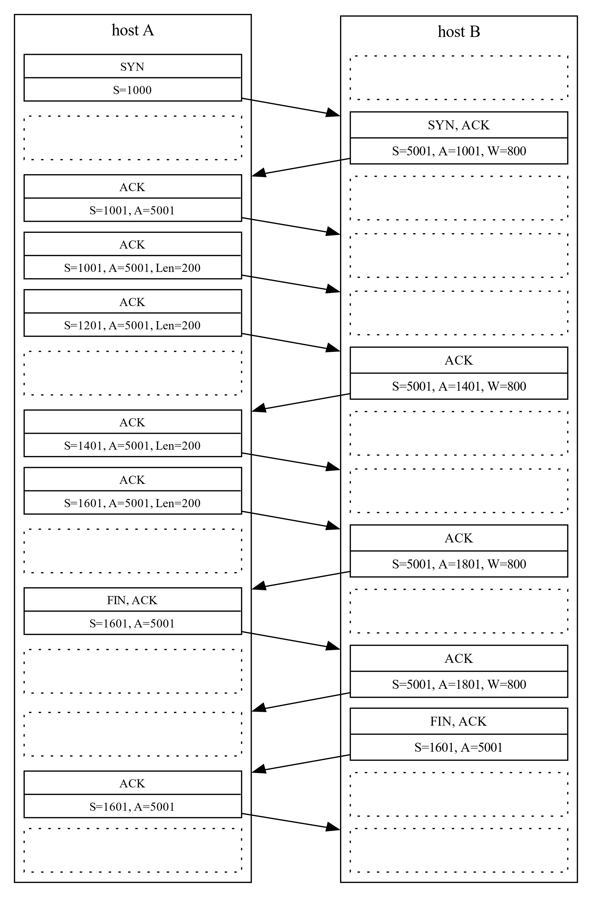

# Guia 2: Nivel de Transporte

Redes de Comunicaciones (TB067) - 2C2024 - FIUBA  
Martin Klöckner - [mklockner@fi.uba.ar](mailto:mklockner@fi.uba.ar)

> 1. ¿Cómo se puede distinguir a qué aplicación debe entregar UDP el datagrama
>    que acaba de llegar? 

Se puede distinguir mediante el número de puerto especificado en la sección 
`puerto de destino` del encabezado UDP.

> 2. ¿Cómo se calcula el checksum de UDP?

El checksum sirve para detectar si los datos contenidos en el encabezados UDP
han sido alterados mientras se trasladaban desde el origen al destino.

En el lado del emisor se calcula el complemento a 1 de la suma de todas las
palabras de 16 bits del segmento, en el caso de haber desbordamiento en la suma
se acarrea sobre el bit de menor peso.

En el receptor, se suman todas las palabras de 16 bits de la sección de datos
del encabezado, incluyendo el checksum, en caso de no haber errores el resultado
debe ser una palabra de 16 bits cuyos bits son todos 1; en caso de haber al
menos un 0, entonces ocurrió un error durante la transmisión.

> 3. Suponga que la ventana de congestión de TCP está en 18 Kbytes. La ventana
>    publicada por el otro extremo de la sesión es de 64 Kbytes. ¿A qué valor
>    llegará dicha ventana si los siguientes 5 segmentos transmitidos resultan
>    exitosos y no se recibió aún ningún ACK? Suponga un tamaño máximo de
>    segmento de 2 Kbytes.

La ventana de congestión indica la cantidad de bytes que pueden estar en la
linea ("on the wire") sin ser validados, suponiendo que el extremo que transmite
es el que tiene la ventana de 18 Kbytes, y la linea que recibe tiene una ventana
de 64 Kbytes, entonces si se envían los  5 segmentos y aun no han sido validados
la ventana de congestión del transmisor deber ser de 8 Kbytes, ya que es el
resultado de restar a la cantidad de bytes de la ventana de congestion del
transmisor la cantidad de datos en la linea.

> 4. Determine el tamaño óptimo de ventana para una sesión TCP en la que el
>    RTT es `100 ms`, el MSS es `600 bytes` y la velocidad de la interfaz de
>    `128 Kbps`.

El tamaño optimo de ventana se puede calcular utilizando la siguiente ecuación:

\vspace{-0.5em}
$$\text{Tamaño Optimo de Ventana}\ = \text{Velocidad de Interfaz} \cdot RTT$$

Reemplazando con los valores de enunciado resulta:

$$\text{Tamaño Optimo de Ventana} = 100 Kbps\cdot 100 ms = 100000\ \nicefrac{bytes}{s}\cdot 0.100s \Rightarrow\boxed{100\ bytes}$$

<!-- $$MTU = MSS + encabezado TCP e IP$$
Si supera el MSS se descarta en cambio si supera el MTU se fragmenta
-->

> 5. Dos Hosts A y B se comunican a través de una sesión TCP. El host B recibió
>    de A todos los bytes hasta el 144. Suponga que el Host A luego envía dos
>    segmentos a B, de 20 y 40 bytes respectivamente. En el primer segmento el
>    número de secuencia es 145, port origen 303 y port destino 80. El Host B
>    envía un ACK siempre que recibe un segmento de A. Responda para cada
>    situación:
>  
>    a. ¿Cuál será el número de secuencia, el número de ACK, y ports origen y
>       destino en el segmento enviado por B al recibir el segmento de 40 bytes?
>    b. Si el segmento de 40 bytes llega antes que el de 20 bytes, indique
>       campos relevantes del segmento que B enviará.
>    c. Suponga que los dos segmentos enviados por A llegan a B en orden. El
>       primer ACK se pierde y el segundo segmento llega después que el timeout
>       del primer segmento expire. Indique los segmentos a intercambiar por
>       parte de A y B a continuación.

a. Suponiendo números de secuencia y reconocimiento relativos al comienzo de la
   sesión; y teniendo en cuenta que el numero de secuencia de A es 145, entonces
   luego de enviar los bytes a B, el numero de secuencia de A será 205, ya que
   envía un total de 60 bytes, cuando B recibe estos datos debe responder
   validando la recepción con un segmento ACK, como suponemos números de
   secuencia y reconocimiento relativos, el numero de reconocimiento con el que
   responde B debe coincidir con el numero de secuencia de los segmentos
   enviados por A, por lo que deben ser 165 y 205 para el primer y segundo
   paquete respectivamente (suponiendo que llegan en orden). Los puertos de
   origen y destino se invierten ya que los segmentos van en el sentido
   contrario del host B al A, por tanto resultan origen 80 y destino 303.
   Finalmente, el numero de secuencia de B debería ser 1, el mismo que luego de
   iniciada la sesión TCP ya que el host B no le envía datos a A, solo valida
   los segmentos que A le envía.
b. Si el segmento de 40 bytes llega primero, el numero de reconocimiento del
   host B y el numero de secuencia del paquete recibido de 40 bytes no
   coinciden; el numero de reconocimiento de B sería 145 mientras que el numero
   de secuencia del paquete es 165, es decir, falta llegar un paquete de 20
   bytes. Ante esta situación puede ocurrir que el host B descarte el paquete de
   40 bytes o que lo guarde en un buffer hasta recibir el segmento faltante,
   esto depende de como esté configurado el stack TCP/IP en el host B.
c. Luego de que el timeout expira en el host A, este retransmite el segmento,
   en el host B el segmento ya se había recibido dicho segmento por lo que se
   descarta pero se vuelve a enviar el segmento ACK al host A.

> 6. En la secuencia de envío de segmentos TCP reflejada en la figura, en la que
>    las líneas horizontales representan tics de reloj, se sabe que:
> 
>    * A desea enviar a B 200 bytes de datos.
>    * B desea enviar a A 100 bytes de datos.
>    * A y B usan un tamaño fijo de datos de 50 bytes.
>    * A y B ajustan la ventana acorde con “congestion avoidance”.
>    * Tanto A como B sólo transmiten segmentos coincidiendo con el tic de
>      reloj.
>    * Todos los segmentos tardan en llegar al destino medio tic de reloj, sino
>      se pierden.
>    * A y B tienen un plazo para retransmitir segmentos de 5 tics de reloj.
>    * A y B enviarán segmentos con datos siempre que puedan.
>    * A y B enviarán un asentimiento cada vez que reciban un segmento con
>      datos.
> 
>    Teniendo en cuenta que la zona sombreada indica un periodo de tiempo
>    durante el cual todos los segmentos transmitidos se perderán y que fuera
>    de dicho periodo no se perderá ningún segmento, complete la transmisión
>    en la figura (incluyendo el cierre de conexión).
> 
>       { width=75% }
>
>  \vspace{-2.75em}

\pagebreak
> 7. Complete la secuencia de envío de segmentos TCP reflejada en la figura,
>    incluyendo el cierre de la conexión, en la que las líneas horizontales
>    representan tics de reloj, sabiendo que:
> 
>    * No se perderá ningún segmento en la transmisión excepto el cuarto con 
>      datos enviados por A.
>    * Los segmentos no dibujados (excepto el anteriormente citado) tardarán en
>      llegar al destino medio tic de reloj, y no se perderán.
>    * A está utilizando arranque lento (Slow Start) para prevenir la 
       congestión.
>    * A tiene que enviar a B 800 bytes de datos, una vez enviados procederá
>      a cerrar la conexión.
>    * B no desea enviar datos a A.
>    * B enviará asentimientos a A cuando haya recibido dos segmentos de A desde
>      el último segmento asentido o cuando hayan sucedido 2 tics de reloj desde
>      el último segmento recibido.
>    * El plazo de retransmisión de segmentos en A (timeout) es de 3 tics de
>      reloj.
> 
>      { width=75% }
>
>  \vspace{-2.75em}

\pagebreak
> 8. Se realizó la captura de las siguientes tramas Ethernet: (tenga en cuenta
>    que se extrajeron los bytes de preámbulo)
> 
> \captionsetup[subfigure]{labelformat=empty}
> { width=48% }
> \hspace{0.5em}
> { width=48% }
> \vspace{-1.00em}
> \begin{figure}[H]
> \begin{subfigure}[t]{0.50\textwidth}
> \caption{Trama 1}
> \end{subfigure}
> \hfill
> \begin{subfigure}[t]{0.478\textwidth}
> \caption{Trama 2}
> \end{subfigure}
> \end{figure}
>
> { width=48% }
> \hspace{0.5em}
> { width=48% }
> \vspace{-1.00em}
> \begin{figure}[H]
> \begin{subfigure}[t]{0.50\textwidth}
> \caption{Trama 3}
> \end{subfigure}
> \hfill
> \begin{subfigure}[t]{0.478\textwidth}
> \caption{Trama 4}
> \end{subfigure}
> \end{figure}
>
> { width=48% }
> \hspace{0.5em}
> { width=48% }
> \vspace{-1.00em}
> \begin{figure}[H]
> \begin{subfigure}[t]{0.50\textwidth}
> \caption{Trama 5}
> \end{subfigure}
> \hfill
> \begin{subfigure}[t]{0.478\textwidth}
> \caption{Trama 6}
> \end{subfigure}
> \end{figure}
> 
>    Se pide: Analizar los campos relevantes de la información de nivel de
>    transporte que contienen.

Analizando el encabezado Ethernet de todas las tramas (bytes en verde) se puede
ver que en todas se utiliza el protocolo de red IPv4, ya que en el ultimo par de
bytes se encuentra `0x0800`. 

Del encabezado IPv4 (bytes en rojo) se puede ver que el protocolo utilizado en
las tramas 1 y 2 es UDP, ya que en el décimo byte se encuentra `0x11` (en
decimal `17`), el cual es el numero correspondiente con este protocolo.

\vspace{1em}
\renewcommand{\arraystretch}{1.25}
\begin{tabularx}{1.00\textwidth} { 
  | >{\centering\arraybackslash}X 
  | >{\centering\arraybackslash}X 
  | >{\centering\arraybackslash}X 
  | >{\centering\arraybackslash}X 
  | >{\centering\arraybackslash}X | }
  \hline
    Trama & Src Port & Dest Port & Length &  Checksum \\ \hline
      1   &   1030   &    53     &    42  &   11432   \\ \hline
      2   &    53    &   1030    &    72  &   13845   \\ \hline
\end{tabularx}
\vspace{1em}

Para las tramas restantes: 3, 4, 5 y 6, el protocolo es TCP, ya que en lugar de
encontrarse `0x11` se encuentra `0x6` (`6` en decimal) el cual corresponde con
este protocolo.

\vspace{1em}
\renewcommand{\arraystretch}{1.25}
\begin{tabularx}{1.00\textwidth\small} { 
  | >{\centering\arraybackslash}X 
  | >{\centering\arraybackslash}X 
  | >{\centering\arraybackslash}X 
  | >{\centering\arraybackslash}X 
  | >{\centering\arraybackslash}X 
  | >{\centering\arraybackslash}X 
  | >{\centering\arraybackslash}X | }
  \hline
  Trama & Src Port & Dest Port &    Seq \#  &    Ack \#  & Win Size &  Flags    \\ \hline
    3   &   3156   &    80     & 4041778071 &      0     &  65535   &  SYN      \\ \hline
    4   &    80    &   3156    &  373009933 & 4041778072 &   5840   &  SYN, ACK \\ \hline
    5   &   3156   &    80     & 4041778072 &  373009934 &  65535   &  ACK      \\ \hline
    6   &   3156   &    80     & 4041778072 &  373009934 &  65535   &  PSH, ACK \\ \hline
\end{tabularx}
\vspace{1em}

> 9. ¿Qué son Slow Start y Congestion Avoidance? ¿Cómo intervienen sobre el
     tráfico?

Arranque lento (Slow Start) y Evitación de Congestión (Congestion Avoidance) son
dos mecanismo que utiliza TCP para evitar la congestion en la linea al
transmitir datos. Para evitar la congestion en la linea, se limita la cantidad
de bytes que el emisor puede enviar sin ser validados por el receptor. Esta
magnitud que define la cantidad de bytes en la linea sin ser reconocidos, se
almacena en el emisor como **ventana de congestion**.

Cuando se establece una sesión TCP, la ventana de congestion del emisor se
establece en `1 MSS` y se incrementa de acuerdo al mecanismo de Arranque lento,
en el cual se duplica por cada segmento ACK recibido, esto provoca que la
ventana de congestion crezca exponencialmente en cada periodo RTT hasta que se
produzca congestion en la red, detectado por ejemplo por la perdida de un
paquete (el cual luego se retransmite), luego de que se detecte la congestion la
ventana de congestion vuelve a un valor pequeño como `1 MSS` y se define un
umbral, el cual queda determinado por la mitad del valor de la ventana de
congestion cuando se produzco la congestion; el valor de la ventana de
congestión vuelve a incrementar exponencialmente pero esta vez hasta el valor
umbral desde donde luego se cambia el mecanismo a evitación de la congestion, en
el cual la ventana de congestion se incrementa linealmente en `1 MSS` por cada
RTT. El mecanismo de arranque lento también puede terminar si se detecta 3
paquetes ACK duplicados, en cuyo caso TCP realiza una retransmisión rápida.

En el modo de evitación de la congestión, el valor de la ventana de recepción es
aproximadamente la mitad del valor que tuvo en la transmisión anterior en la
cual hubo congestion, en este modo la ventana de congestion se incrementa
linealmente y se termina en los mismo caso que para arranque lento.
