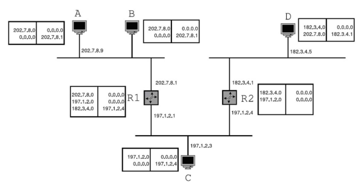

# Guia 3: Nivel de Red

Redes de Comunicaciones (TB067) - 2C2024 - FIUBA  
Martin Klöckner - [mklockner@fi.uba.ar](mailto:mklockner@fi.uba.ar)

> 1. ¿Cómo se calcula la longitud de los datos en un datagrama IP?

El campo longitud de datos de la cabecera de un datagrama IP se calcula como la
suma entre la longitud de la cabecera IP y la longitud de los datos.

> 2. Explique la función del campo de Identificación del datagrama IP.

El campo identificación del datagrama IP se utiliza cuando un datagrama IP debe
fragmentase en la ruta entre el emisor y el destino; un datagrama IP se envía
desde el emisor con un único número de identificación, si debe fragmentarse en
transito cada fragmento tendrá su propia cabecera IP, pero llevará el número de
identificación correspondiente al datagrama original del cual fue fragmentado.
Luego cuando todos los fragmentos lleguen a destino este sabrá que fragmento
corresponde con que datagrama y podrá reensamblar el datagrama sin problemas. 

> 3. ¿Cuál es la utilidad del campo TTL?

El campo Tiempo de vida (TTL, Time-To-Live) se incluye con el fin de garantizar
que los datagramas no estarán eternamente en circulación a través de la red
(debido, por ejemplo, a un bucle de enrutamiento de larga duración). Este campo
se decrementa en una unidad cada vez que un router procesa un datagrama. Si el
campo TTL alcanza el valor `0`, el datagrama tiene que ser descartado por el
router.

> 4. ¿Usted cree necesario y útil el protocolo ICMP? Justifique.

El protocolo ICMP resulta muy útil para el reporte de errores entre routers y/o
hosts, aunque no se limita solo a eso. Por ejemplo, en un datagrama IP, cuando
se acaba el TTL en un router, este lo descarta y debe informar al usuario de
alguna manera que por algún motivo tuvo que descartar ese datagrama; esta
manera es mediante mensajes ICMP, ante esta situación el router envía un
mensaje ICMP al emisor del datagrama e incluye una copia entera del encabezado
y 8 bytes de la sección de datos del datagrama IP que originó el error.

Otro ejemplo del uso de mensajes ICMP es cuando un host envía un mensaje HTTP a
un servidor pero en el camino algún router no pudo encontrar una ruta hacia el
servidor, ante esta situación ese mismo router genera un datagrama ICMP y lo
envía al emisor del datagrama, informando el error mediante un mensaje de tipo
"Red de destino inalcanzable".

<!--
ICMP a menudo se considera parte de IP pero, en sentido arquitectónico, se
encuentra justo encima de IP, ya que los mensajes ICMP son transportados dentro
de datagramas IP. Es decir, los mensajes ICMP son transportados como carga útil
de IP, al igual que los segmentos TCP o UDP son transportados como carga útil de
IP. De forma similar, cuando un host recibe un datagrama IP con ICMP
especificado como el protocolo de la capa superior (número de protocolo de la
capa superior igual a 1), demultiplexa el contenido del datagrama hacia ICMP, al
igual que demultiplexaría el contenido de un datagrama hacia TCP o UDP
-->

> 5. ¿Qué tipos de mensajes puede llevar el protocolo ICMP?

A continuación se muestra una serie de tipos de mensajes ICMP, se muestran
los mas utilizados, ya que algunos se dejaron de usar (obsoletos) y algunos son
incluso experimentales.

\vspace{1em}
\renewcommand{\arraystretch}{1.25}
\begin{tabularx}{1.00\textwidth} { 
  | >{\centering\arraybackslash}c
  | >{\centering\arraybackslash}X | }
  \hline
    \bfseries Tipo & \bfseries Descripción \\ \hline
    0 & Echo Reply \\ \hline
    3 & Destination Unreachable \\ \hline
    5 & Redirect \\ \hline
    8 & Echo \\ \hline
    9 & Router Advertisement \\ \hline
    10 & Router Solicitation \\ \hline
    11 & Time Exceeded \\ \hline
    12 & Parameter Problem \\ \hline
    13 & Timestamp \\ \hline
    14 & Timestamp Reply \\ \hline
\end{tabularx}
\vspace{1em}

El encabezado ICMP además de incluir un campo de tipo incluye un campo de
código, este ultimo se utilizada para agregar contexto al tipo de mensaje ICMP.
A continuación se muestran códigos para los tipos de mensajes ICMP mencionados
en la tabla anterior.

\vspace{1em}
\renewcommand{\arraystretch}{1.25}
\begin{tabularx}{1.00\textwidth} { 
  | >{\centering\arraybackslash}c 
  | >{\centering\arraybackslash}c 
  | >{\centering\arraybackslash}X | }
  \hline
  \bfseries Tipo & \bfseries Código & \bfseries Descripción               \\ \hline
               0 &                0 & Echo Reply                          \\ \hline
               3 &                0 & Net Unreachable                     \\ \hline
               3 &                1 & Host Unreachable                    \\ \hline
               3 &                2 & Protocol Unreachable                \\ \hline
               3 &                3 & Port Unreachable                    \\ \hline
               3 &                4 & Fragmentation needed and DF was set \\ \hline
               3 &                6 & Destination Net Unknown             \\ \hline
               3 &                7 & Destination Host Unknown            \\ \hline
               5 &                5 & Redirect                            \\ \hline
               5 &                5 & Redirect                            \\ \hline
               5 &                5 & Redirect                            \\ \hline
               8 &                0 & Echo                                \\ \hline
              11 &                0 & Time To Live Exceeded               \\ \hline
              11 &                1 & Fragment Reassembly Time Exceeded   \\ \hline
\end{tabularx}
\vspace{1em}


> 6. ¿Por qué se utiliza la aplicación `traceroute` para relevar las direcciones
>    IP del camino que sigue un datagrama IP en llegar a destino en lugar de
>    utilizar dicho datagrama con la opción IP `Record Route` para almacenar las
>    direcciones IP del camino utilizado?

* Record Route tiene una limitación de direcciones IP (máximo 9).
* Muchos routers no soportan o ignoran la opción Record Route.
* traceroute proporciona información adicional como el tiempo de respuesta de
  cada salto.
* traceroute es más flexible, eficiente y ampliamente soportado que la opción
  Record Route.

> 7. ¿Qué significa un servicio Best-effort ? ¿Se puede implementar QoS
>    utilizando IP? 

El modelo de servicio de IP es un servicio de entrega de mejor esfuerzo (best
effort). Esto quiere decir que IP hace todo lo que puede por entregar los
segmentos entre los hosts que se están comunicando, pero no garantiza la
entrega. En particular, no garantiza la entrega de los segmentos, no garantiza
que los segmentos se entreguen en orden y no garantiza la integridad de los
datos contenidos en los segmentos. Por estas razones, se dice que IP es un
servicio no fiable.

> 8. Indicar cuáles de las siguientes afirmaciones son correctas:
>    a. Si el offset de un datagrama IP es nulo es condición suficiente para
>       concluir que no fue fragmentado.
>    b. El host destino puede reensamblar los fragmentos de un datagrama IP.
>    c. Un router puede reensamblar los fragmentos de un datagrama IP si el MTU
>       de la red por la que forwardea puede soportar el datagrama reensamblado.
>    d. Si el host destino no logra reunir los datagramas IP en un determinado
>       intervalo de tiempo envía un mensaje ICMP de TTL Exceeded.
>    e. Si un router no logra reunir los datagramas IP en un determinado
>       intervalo de tiempo envía un mensaje ICMP de Time Exceeded.
>    f. Si el TTL se hace nulo en alguno de los fragmentos, el router que
>       procesa dicho fragmento lo descarta y envía un mensaje ICMP Destination
>       Unreachable.

a. Falso ya que puede que el datagrama haya sido fragmentado pero se trate del
   primer fragmento.
b. Verdadero, el datagrama IP solo se ensambla en el destino, en transito solo
   puede ser fragmentado si la red lo requiere.
c. False justamente por lo dicho en el punto **anterior**.
d. Falso, el mensaje ICMP TTL Exceeded solo se envía cuando el TTL del datagrama
   llega a 0, cuando el host destino no logra reunir los datagramas IP
   simplemente lo descarta.
e. Falso, ya que el router no espera reunir ningún datagrama IP, en todo caso el
   host pero ocurre lo mencionado previamente, el host simplemente descartaría
   los datagramas.
f. Verdadero.

> 9. Dado un datagrama de 1000 bytes que debe atravesar una red con tamaño
>    máximo de transmisión es 300 bytes, escriba los headers de todos los
>    fragmentos.

El tamaño máximo de transmisión (MTU) es la cantidad máxima de datos que una
trama de la capa de enlace puede transportar. Puesto que cada datagrama IP se
encapsula dentro de una trama de la capa de enlace para ir de un router al
siguiente, la MTU del protocolo de la capa de enlace impone un límite a la
longitud de un datagrama IP. En este caso se tiene un MTU de 300 bytes y un
datagrama de 1000 bytes, el resultado luego de atravesar la red será de 4
datagramas más pequeños, 3 datagramas de tamaño 300 bytes y 1 de 100 bytes.

El encabezado de los 4 fragmentos compartirá la mayoría de los campos del
datagrama original, como las direcciones IP de origen y destino, el numero de
identificación del datagrama, el protocolo, la version, el tipo de servicio,
etc; a diferencia que en cada fragmento los siguientes 4 campos cambiarán:

* El campo longitud total tendrá la longitud del fragmento, para los 3 primero
  300 y para el ultimo 100.
* El bit MF (More Fragments) será `1` para los primero 3 fragmentos y `0` para
  el ultimo.
* El campo Offset será distinto de 0 para los últimos 3 fragmentos, para el
  segundo fragmento será 35, para el tercero 70 y para el ultimo 105; este
  "offset" corresponde con el tamaño de cada fragmento en múltiplos de 8 bytes,
  el calculo realizado es el siguiente:

  $$\frac{\text{MTU}\ -\ \text{Longitud del Encabezado IP}}{8} = 35$$

  Entonces para el primer fragmento se calcula como $0\cdot 35$, para el segundo
  $1 \cdot 35$ y así sucesivamente para el resto
* Por ultimo el campo Checksum se recomputa ya que debe ser único para cada
  fragmento.

\vspace{1em}
\renewcommand{\arraystretch}{1.25}
\begin{tabularx}{1.00\textwidth} { 
  | >{\centering\arraybackslash}X 
  | >{\centering\arraybackslash}X 
  | >{\centering\arraybackslash}X 
  | >{\centering\arraybackslash}X | }
  \hline
  {\bfseries Fragmento}          &
  {\bfseries Longitud Total [B]} &
  {\bfseries Offset}             &
  {\bfseries MF}
  \\ \hline
    1 & 300 &   0 & 1 \\ \hline
    2 & 300 &  35 & 1 \\ \hline
    3 & 300 &  70 & 1 \\ \hline
    4 & 160 & 105 & 0 \\ \hline
\end{tabularx}
\vspace{1em}


> 10. Si en el ejercicio anterior el datagrama atravesara otra red de 
>     `MTU = 200 bytes`, escriba los headers de todos los fragmentos.

Si el datagrama ya fragmentado atraviesa una red de MTU = 200 bytes entonces
los primeros 3 fragmentos deberán fragmentarse nuevamente, quedando en total
7 fragmentos: 3 fragmentos de 200 bytes y 4 fragmentos de 100 bytes.
El bit MF será 1 en todos los fragmentos a excepción del ultimo en el que será
0. El tamaño de carga útil del fragmento debe ser divisible por 8, ya que se
expresa en múltiplos de 8 bytes en el encabezado, en este caso teniendo un MTU
de 200 bytes y restando la longitud del encabezado, resulta en un offset que no
es múltiplo de 8:

$$\frac{\text{MTU}\ -\ \text{Longitud del Encabezado IP}}{8}
= \frac{200-20}{8} = 22.5$$

Los fragmentos de 200 bytes se fragmentarán entonces en dos fragmentos: cuya
longitud total de cada uno es 196 bytes y 124 bytes. Siendo el offset del
primero 0 y del segundo 22, para los siguientes fragmentos se suma el
fragment offset del diagrama original a este offset provocado por esta última
fragmentación.

\vspace{1em}
\renewcommand{\arraystretch}{1.25}
\begin{tabularx}{1.00\textwidth} { 
  | >{\centering\arraybackslash}X 
  | >{\centering\arraybackslash}X 
  | >{\centering\arraybackslash}X 
  | >{\centering\arraybackslash}X | }
  \hline
  {\bfseries Fragmento}          &
  {\bfseries Longitud Total [B]} &
  {\bfseries Offset}             &
  {\bfseries MF}
  \\ \hline
    1 & 196 &   0 & 1 \\ \hline
    2 & 124 &  22 & 1 \\ \hline
    3 & 196 &  35 & 1 \\ \hline
    4 & 124 &  52 & 1 \\ \hline
    5 & 196 &  70 & 1 \\ \hline
    6 & 124 &  92 & 1 \\ \hline
    7 & 100 & 105 & 0 \\ \hline
\end{tabularx}
\vspace{1em}

> 11. En el siguiente esquema de red, el host A envía un ping al host B pero el
>     mismo se encuentra apagado. Suponiendo que todos los routers y hosts
>     tienen activados sus protocolos ICMP sin filtrar, indicar si el ping se
>     realiza con éxito o qué sucede en caso contrario.
> 
>     

> 12. Un host A envía un ping a un host B y configura el TTL del datagrama IP
>     que encapsula el mensaje ICMP Echo Request en un valor igual a 200. Entre
>     el host A y el host B existe un único camino comprendido por 5 saltos, sin
>     embargo, el TTL del datagrama IP que encapsula el mensaje ICMP Echo Reply
>     generado por el host B hacia el host A tiene un valor igual a 15. A qué se
>     debe?

> 13. Dado el siguiente datagrama IP (Los dígitos son hexadecimales), responda:
>     a. Indique las direcciones IP origen y destino en su formato
>        correspondiente
>     b. ¿Si la red destino tiene definido un MTU = 20 bytes, el datagrama será
>        fragmentado?
>     c. ¿Cuántas redes podrá atravesar antes de llegar a destino?
>     d. ¿Tiene opciones? Justifique.
>     e. ¿El campo de datos contiene protocolo auxiliar o de transporte?
> 
>     \vspace{1em}
>     ```
>         45 00 00 2c 06 00 40 00 
>         20 06 28 4f 82 39 14 0a 
>         82 39 14 01 04 02 02 0c 
>         00 00 32 98 00 00 00 00 
>         60 02 20 00 13 03 00 00 
>         02 04 05 b4
>     ```
>     <!--`fix-vim-highlight--->
>     \vspace{1em}

Dado el primer byte del encabezado: `0x45`, expresado en binario resulta
`01000101`, de los primeros 4 bits se obtiene la versión, en este caso versión 4.

a. La dirección IP de origen y destino resulta `130.57.20.10` y `130.57.20.1`
   respectivamente.
b. De los últimos 4 bits del primer byte del encabezado se obtiene la longitud
   de la cabecera, la cual resulta 20 bytes (el campo contiene 5 y se multiplica
   por 32 bits). Por lo tanto el datagrama debe ser fragmentado.
c. En el noveno byte del encabezado se encuentra el campo TTL, en este caso es
   32, por lo que esa será la cantidad maxima de saltos que podrá realizar el
   datagrama antes de ser descartado.
d. No, no tiene opciones ya que la longitud del encabezado es 20 bytes.
e. El protocolo de transporte es TCP, ya que se indica el numero 6 en el campo
   de protocolo (décimo byte del encabezado)

> 14. Usted obtuvo la dirección IP 205.25.67.0. Determinó que necesita crear 5
>     subredes. 
>     Complete la siguiente tabla teniendo en cuenta que las subredes "todo 0" y
>     "todo 1" no se pueden utilizar:
> 
>     \vspace{1em}
>     \begin{center}
>     \renewcommand{\arraystretch}{1.25}
>     \begin{tabularx}{\textwidth} { 
>       | >{\centering\arraybackslash}X 
>       | >{\centering\arraybackslash}X 
>       | >{\centering\arraybackslash}X 
>       | >{\centering\arraybackslash}X 
>       | >{\centering\arraybackslash}X | }
>       \hline
>       \small
>         Número mínimo de bits para las subredes        &
>         Máscara                                        &
>         Primera dirección de host de la quinta subred  &
>         Dirección de Broadcast de la tercera subred    &
>         Número total de direcciones que no se utilizan \\ \hline
>         & & & & \\ \hline
>     \end{tabularx}
>     \end{center}
>     \vspace{1em}

\vspace{1em}
\begin{center}
\renewcommand{\arraystretch}{1.25}
\begin{tabularx}{\textwidth} { 
  | >{\centering\arraybackslash}X 
  | >{\centering\arraybackslash}X 
  | >{\centering\arraybackslash}X 
  | >{\centering\arraybackslash}X 
  | >{\centering\arraybackslash}X | }
  \hline
  \small
    Número mínimo de bits para las subredes        &
    Máscara                                        &
    Primera dirección de host de la quinta subred  &
    Dirección de Broadcast de la tercera subred    &
    Número total de direcciones que no se utilizan \\ \hline
    3 & 255.255.224.0 & 205.25.67.161 & 205.25.67.127 & 12 \\ \hline
\end{tabularx}
\end{center}
\vspace{1em}

> 15. Dada la siguiente tabla de ruteo basada en clases, reescríbala utilizando
>     CIDR intentando minimizar lo más posible el número de entradas: 
> 
>     \vspace{1em}
>     \begin{center}
>     \renewcommand{\arraystretch}{1.25}
>     \begin{tabularx}{0.65\textwidth} { 
>       | >{\centering\arraybackslash}X 
>       | >{\centering\arraybackslash}X | }
>       \hline
>            Destino    & Proixmo Salto \\ \hline
>         212.128.175.0 &   15.0.0.1    \\ \hline
>         212.128.176.0 &   15.0.0.1    \\ \hline
>         212.128.177.0 &   15.0.0.1    \\ \hline
>         212.128.178.0 &   15.0.0.1    \\ \hline
>         212.128.179.0 &   15.0.0.1    \\ \hline
>         212.128.180.0 &   15.0.0.1    \\ \hline
>         212.128.181.0 &   15.0.0.1    \\ \hline
>         212.128.182.0 &   15.0.0.1    \\ \hline
>         212.128.183.0 &   15.0.0.1    \\ \hline
>         212.128.184.0 &   15.0.0.1    \\ \hline
>         212.128.185.0 &   15.0.0.1    \\ \hline
>     \end{tabularx}
>     \end{center}
>     \vspace{1em}

\vspace{1em}
\begin{center}
\renewcommand{\arraystretch}{1.25}
\begin{tabularx}{0.65\textwidth} { 
  | >{\centering\arraybackslash}X 
  | >{\centering\arraybackslash}X 
  | >{\centering\arraybackslash}X | }
  \hline
      Destino   & Mascara & Próximo Salto \\ \hline
    212.128.0.0 &   /16   &    15.0.0.1   \\ \hline
\end{tabularx}
\end{center}
\vspace{1em}

> 16. En la tabla de ruteo siguiente indique la entrada que tendrán
>     correspondencia con la dirección destino 128.9.200.20. Por qué interfaz
>     será transmitido un datagrama que tenga esa dirección destino. Explicar.
> 
>     \vspace{1em}
>     \begin{center}
>     \renewcommand{\arraystretch}{1.25}
>     \begin{tabularx}{0.65\textwidth} {
>       | >{\centering\arraybackslash}X 
>       | >{\centering\arraybackslash}X 
>       | >{\centering\arraybackslash}X | }
>       \hline
>            Destino & Prefijo & Interfaz \\ \hline
>          128.0.0.0 &   /8    &     3    \\ \hline
>          128.9.0.0 &   /16   &     5    \\ \hline
>        128.9.192.0 &   /20   &     2    \\ \hline
>        128.9.192.0 &   /22   &     4    \\ \hline
>        128.9.192.0 &   /24   &     7    \\ \hline
>        128.9.200.0 &   /24   &     8    \\ \hline
>        128.9.200.0 &   /28   &    10    \\ \hline
>       128.9.200.16 &   /28   &     1    \\ \hline
>       128.9.200.16 &   /30   &     9    \\ \hline
>        128.9.192.8 &   /30   &     6    \\ \hline
>     \end{tabularx}
>     \end{center}
>     \vspace{1em}

En las tablas de ruteo, las entradas que sean mas especificas, es decir, las
entras las cuales coincide la mayor cantidad de bits con respecto al destino que
se busca, será la que tenga mayor prioridad. En este caso, la entrada más
especifica a la dirección IP de destino `128.9.200.20` es `128.9.200.16/28` la
cual tiene como interfaz asociada la número `1`.

> 17. Suponer que la siguiente secuencia de bytes, en hexadecimal, es una
>     cabecera IP. Y responder a las siguientes cuestiones: 
>     a. ¿Cuál es la longitud del datagrama? 
>     b. ¿Se trata de un fragmento? 
>     c. ¿A qué hosts (IP) va dirigido? 
>     d. ¿Qué host lo envió? 
>     e. Discutir si están o no en la misma red.
>     ```
>     45 00 00 4E C3 2A 00 00 80 11 17 44 82 CE AA 94 82 CE AF FF
>     ```
>     <!--`fix-vim-highlight--->

a. La longitud del datagrama es 78 bytes, esto se anuncia en el campo longitud
   total de la cabecera (tercer y cuarto byte de la cabecera)
b. No, ya que el bit MF es 0 y el offset también es 0.
c. El host de destino es la dirección `130.206.175.255`
d. El host que lo envía es el que tiene dirección `130.206.170.148`.
e. No se puede saber a priori sin saber la masca de subred.

> 18. Para las siguientes direcciones de hosts y máscaras de subred encuentre la
>     subred a la que pertenece cada host, la dirección de broadcast de cada
>     subred y el rango de direcciones de hosts para cada subred:
>     a. 10.14.87.60/19
>     b. 172.25.0.235/27
>     c. 172.25.16.37/25

\vspace{1em}
\begin{center}
\renewcommand{\arraystretch}{1.25}
\begin{tabularx}{\textwidth} { 
  | >{\centering\arraybackslash}c 
  | >{\centering\arraybackslash}c 
  | >{\centering\arraybackslash}c 
  | >{\centering\arraybackslash}c 
  | >{\centering\arraybackslash}X | }
  \hline
  \small
     Direccion  & Mascara &    Subred    &   Broadcast  &   Rango de Direcciones    \\ \hline
    10.14.87.60 &   /16   &   10.14.64.0 & 10.14.95.255 &   10.14.64.1-10.14.95.254 \\ \hline
   172.25.0.235 &   /27   & 172.25.0.225 & 172.25.0.255 & 172.25.0.226-172.25.0.254 \\ \hline
   172.25.16.37 &   /25   &  172.25.16.0 & 10.14.95.127 &  172.25.16.1-10.14.95.126 \\ \hline
\end{tabularx}
\end{center}
\vspace{1em}

> 19. Se desea configurar una interfaz con la dirección 192.168.13.175 con una
>     máscara de 255.255.255.240, hay algún problema?

Si, el problema es que para la mascara 255.255.255.240 o /28 la dirección
`192.168.13.175` coincide con la dirección de broadcast de la subred
`192.168.13.160/28`.

> 20. Dados los siguientes resultados en la ejecución del ping:
>     a. A cuántas redes de distancia estima que podría estar el destino? 
>     b. A qué se podría deber el paquete perdido?
> 
>     ```console
>     C:\>ping 170.6.2.23  
> 
>     Haciendo ping 170.6.2.23 con 32 bytes de datos:  
> 
>     Respuesta desde 170.6.2.23: bytes=32 tiempo=241.4 ms TTL=249  
>     Respuesta desde 170.6.2.23: bytes=32 tiempo=244.8 ms TTL=249  
>     Tiempo de espera agotado para esta solicitud.  
>     Respuesta desde 170.6.2.23: bytes=32 tiempo=237.1 ms TTL=249  
> 
>     Estadísticas de ping para 170.6.2.23:  
> 
>     Paquetes: enviados = 4, recibidos = 3, perdidos = 1 <25% perdidos>,  
>     Tiempos aproximados de ida y vuelta en milisegundos:  
> 
>     Mínimo = 237.1 ms, Máximo = 244.8 ms, Media = 241.1 ms  
>     ```
>     <!--`fix-vim-highlight--->

> 21. Un host A envía a otro host B un datagrama de 8000 bytes (incluida la
>     cabecera IP, que tiene 20 bytes). El datagrama se fragmenta en ruta de
>     forma que B recibe varios datagramas que suman en total 8100 bytes
>     (incluidas las cabeceras). ¿Cuántos fragmentos ha recibido B? Desarrollar
>     la respuesta. 

Ha recibido un total de 6 fragmentos, ya que por cada fragmento que se crea se
agregan 20 bytes. Los 100 bytes adicionales corresponden a 5 nuevos
fragmentos, junto con el primer fragmento, cuya cabecera de 20 bytes se cuenta
en los 8000 bytes.

> 22. En el esquema de red de la figura siguiente los equipos A y B son
>     computadoras de usuario mientras que los equipos R1 y R2 son enrutadores.
>     No se utiliza la funcionalidad de NAT (Network Address Translation). En
>     LAN1 se dispone de 80 equipos como B y en LAN2 45 como A. 
> 
>     
> 
>     Se dispone del rango de direcciones 200.40.30.0/24 para asignar a las
>     subredes LAN1 y LAN2. La asignación debe realizarse teniendo en cuenta que
>     no habrá crecimiento de equipos en LAN1 y LAN2. 
> 
>     a. Asignar un rango de direcciones a cada LAN. 
>     b. Asignar direcciones IP a los equipos A, B, R1 y R2. El enlace de R1 con
>        Internet es un enlace punto a punto configurado con las direcciones
>        indicadas en la figura. 
>     c. Especificar las tablas de rutas necesarias en los equipos para que
>        puedan comunicarse entre sí y con cualquier equipo de Internet.

La dirección asignada 200.40.30.0/24 tiene capacidad para 254 hosts, tomando un
bit para la subred se tienen dos subredes con capacidad para 126 hosts. Para
ambas subredes alcanza, pero se puede hacer mas eficiente en el caso de LAN2,
ya que tomando otro bit de subred se tienen dos subredes con capacidad para 62
hosts, con lo cual para LAN2 alcanza (pero no para LAN1). Entonces para LAN1 se
tiene la subred 200.40.30.0/25 y para LAN2 se tiene la subred 200.40.30.128/26,
y sobra una subred en 200.40.30.192/26 con capacidad para 62 hosts.

El host A podría tomar por ejemplo la dirección 200.40.30.140/26, el host B
podría tomar la dirección 200.40.30.11/25, la interfaz de R2 en LAN1 podría
tomar la dirección 200.40.30.1/25, la interfaz de R2 en LAN2 200.40.30.129/26 y
la interfaz de R1 en LAN2 200.40.30.130/26.

\begin{table}[h]
\centering\small
\begin{minipage}{0.45\textwidth}
\centering
\setlength{\arrayrulewidth}{0.5pt}
\begin{tabular}{|c|c|c|c|}
  \hline
  \textbf{Red}     & \textbf{Máscara} & \textbf{Próximo salto} \\ \hline
     200.40.30.128 & /26              & -                      \\ \hline
       200.40.30.0 & /25              & 200.40.30.129          \\ \hline
         0.0.0.0   & /0               & 200.40.30.130          \\ \hline
\end{tabular}
\caption{Tabla de ruta del host A}
\end{minipage}
\hspace{20pt}
\begin{minipage}{0.45\textwidth}
\centering
\setlength{\arrayrulewidth}{0.5pt}
\begin{tabular}{|c|c|c|c|}
  \hline
  \textbf{Red}   & \textbf{Máscara} & \textbf{Próximo salto} \\ \hline
     200.40.30.0 & /25              & -                      \\ \hline
         0.0.0.0 & /0               & 200.40.30.1            \\ \hline
\end{tabular}
\caption{Tabla de ruta del host B}
\end{minipage}
\end{table}

\begin{table}[h]
\centering\small
\begin{minipage}{0.45\textwidth}
\centering
\setlength{\arrayrulewidth}{0.5pt}
\begin{tabular}{|c|c|c|c|}
  \hline
  \textbf{Red}     & \textbf{Máscara} & \textbf{Próximo salto} \\ \hline
        200.40.0.0 & /30              & -                      \\ \hline
     200.40.30.128 & /26              & -                      \\ \hline
       200.40.30.0 & /25              & 200.40.30.129          \\ \hline
           0.0.0.0 & /0               & 200.40.0.2             \\ \hline
\end{tabular}
\caption{Tabla de ruta de R1}
\end{minipage}
\hspace{20pt}
\begin{minipage}{0.45\textwidth}
\centering
\setlength{\arrayrulewidth}{0.5pt}
\begin{tabular}{|c|c|c|c|}
  \hline
  \textbf{Red}     & \textbf{Máscara} & \textbf{Próximo salto} \\ \hline
       200.40.30.0 & /25              & -                      \\ \hline
     200.40.30.128 & /26              & -                      \\ \hline
           0.0.0.0 & /0               & 200.40.30.130          \\ \hline
\end{tabular}
\caption{Tabla de ruta de R2}
\end{minipage}
\end{table}

> 23. Una empresa compra el rango de direcciones IP 152.165.10.0/23. Si se
>     quiere dividir la red en dos subredes iguales, ¿cuáles serían (formato
>     a.b.c.d/x) y cuántos equipos podrían direccionarse en cada una de ellas?
>     Indicar también la dirección de broadcast de cada subred. 

El rango de direcciones que compra la empresa tiene capacidad para 510 hosts, al
dividir la red resulta en las subredes 152.165.10.0/24 y 152.165.11.0/24, las
cuales cada una tiene capacidad para 254 hosts. La dirección de broadcast de la
subred 152.165.10.0 es 152.165.10.255 y la de la subred 152.165.11.0 es
152.165.11.255.

> 24. Una gran empresa desea asignar una dirección pública a cada uno de sus
>     servidores y a cada uno de sus routers (R1, R2 y R3). La empresa dispone de
>     40 servidores en su sede A, 28 servidores en su sede B y 5 servidores en su
>     sede C. Para ello, la empresa adquirió el rango 187.199.32.0/25.
> 
>     
>
> \vspace{-2em} 
> a. Realizar la asignación de rangos a las diferentes subredes A, B, C, D,
>    E y F.
> b. Proponer una IP para cada interfaz de cada router.
> c. Proponer una IP para un servidor en A, otro en B y otro en C.

> 25. Responda a las siguientes preguntas justificando sus respuestas. 
> a. Dada la dirección IP 192.168.1.1 con máscara de 24 bits en 1 (/24),
>    indicar dirección de red que identifica el bloque, dirección de broadcast
>    y máscara de red en notación decimal separada por puntos. 
> b. Dada la dirección IP 10.1.1.35 y máscara 255.255.255.248, indicar el
>    rango de direcciones IP que pertenecen a su LAN. 
> c. ¿Es posible sumarizar en un solo rango los siguientes bloques de
>    direcciones IP: 200.40.0.0/20, 200.40.16.0/21, 200.40.24.0/21,
>    200.40.32.0/19, 200.40.64.0/18 y 200.40.128.0/17, en un solo rango con
>    notación A.B.C.D/M? En caso afirmativo, hallar A, B, C, D y M.

\HandRight [OJO] los routers también necesitan una dirección en el rango de
hosts, por lo que hay que guardar direcciones para los routers al momento de
contar las direcciones disponibles en el espacio de hosts

> 26. Suponer que usted es el administrador de red de un ISP y se dispone del
>     bloque de direcciones: 128.20.224.0/20. El ISP tiene dos clientes con
>     redes de 1.000 nodos cada una; dos clientes con redes de 500 nodos cada
>     una y tres clientes con redes de 250 nodos cada una. ¿Cuáles serán los
>     bloques de direcciones que usted asignará a los clientes? Suponer que
>     todos los clientes restantes tienen redes de 50 nodos cada una. ¿A cuántos
>     de esos clientes podrá asignarle direcciones?

> 27. Considere la red de la figura, y las siguientes suposiciones:
> * En todo momento estamos suponiendo como máscara de red: 255.255.255.0. Las
>   direcciones MAC se representan por el último byte. 
> * Se supone que las PCs funcionan bien y, si reciben un mensaje ICMP Echo,
>   responden adecuadamente. 
> * Se supone que los routers funcionan bien y envían mensajes ICMP adecuados si
>   no encuentran una ruta. 
> * El TTL inicial es 5. 
> * En la nube, para llegar a H1, se pasa por 3 routers: 62.21.4.1; 62.21.5.5;
>   34.56.78.1  
> \vspace{0.5em}
> Responder:
> a. ¿Qué valores puede adoptar la IP de PC5? ¿Por qué? 
> b. ¿Cuáles serán las direcciones origen y destino de los datagramas que
>    saldrán de R1 cuando PC1 envíe datagramas a H1? 
> c. PC1, PC2 y PC3 envían un ping a PC4. ¿Qué ruta seguirán los mensajes
>    enviados y recibidos en cada caso? 

> 28. En la figura se muestra una red. Al lado de cada máquina aparece su tabla de
>     ruteo. Al lado de cada interfaz de comunicaciones aparece su dirección IP
>     (salvo en el caso de la máquina B).  
> 
>     \vspace{-1em}
> 
>     
> 
>     \vspace{-2em}
>     a. Asignar una dirección IP a la interfaz de comunicaciones de la máquina B. 
>     b. Responder: 
>        1. ¿Puede A enviar datagramas IP a C? 
>        2. ¿Puede D enviar datagramas IP a C? 
>     c. Modificar la tabla de ruteo de R2 para que: 
>        * pueda enviar datagramas IP a A 
>        * pueda enviar datagramas IP a A

> 30. En la figura se muestra una red basada en protocolos TCP/IP. La máscara de
>     cada subred es 255.255.255.0. No se permiten rutas por defecto. La tabla
>     de enrutamiento de A se muestra en la figura. El resto de tablas se supone
>     que no impiden ningún camino de comunicación. 
> 
>     \vspace{-1em}
> 
>     
> 
>     \vspace{-2em}
> 
> Responder y justificar:
> 
> a. ¿Qué dirección IP podría tener H? ¿Y F?
> b. ¿Puede hablar A con C?
> c. ¿Puede hablar A con E?
> d. ¿Cómo habría que actualizar alguna tabla de encaminamiento para que A hable
>    con C pero no con D?
> e. Explicar la secuencia de tramas que precede a la recepción del primer
>    datagrama enviado de E a C, explicando el significado y contenido de los
>    campos más significativos. Asignar las direcciones Ethernet que se consideren
>    convenientes.

> 32. Dada la siguiente tabla de ruteo de un host, resuelva:  
> Rutas activas: 
> 
> \vspace{1em}
> \renewcommand{\arraystretch}{1.25}
> \begin{tabularx}{1.0\textwidth} { 
>   | >{\centering\arraybackslash}X 
>   | >{\centering\arraybackslash}X 
>   | >{\centering\arraybackslash}X 
>   | >{\centering\arraybackslash}X 
>   | >{\centering\arraybackslash}X | }
>   \hline
>   \small
>       Destino & Máscara & Siguiente Salto & Interfaz & Métrica \\
>   \hline
>       0.0.0.0 & 0.0.0.0 & 10.6.2.241 & 10.6.2.52 & 20 \\
>   \hline
>       10.6.0.0  & 255.255.0.0     &  & 10.6.2.52 & 20 \\
>   \hline
>       10.6.2.52 & 255.255.255.255 &  & 127.0.0.1 & 20 \\
>   \hline
>       10.255.255.255  & 255.255.255.255  &  & 10.6.2.52  & 20 \\
>   \hline
>       127.0.0.0& 255.0.0.0  &  & 127.0.0.1  & 1  \\
>   \hline
>       224.0.0.0& 240.0.0.0  &  & 10.6.2.52  & 20 \\
>   \hline
> \end{tabularx}
> \vspace{1em}
> 
> a. Un datagrama enviado por dicho host cuya dirección destino es 145.57.2.98,
>    por qué interfaz sale y cuál es el siguiente salto para dicho datagrama? 
> b. Un datagrama enviado por dicho host cuya dirección destino es 127.0.3.4, por
>    qué interfaz sale y cuál es el siguiente salto para dicho datagrama? 
> c. Si se elimina la primer entrada de la tabla de ruteo y se envía un datagrama
>    por dicho host cuya dirección destino es 201.11.3.124, por qué interfaz sale y
>    cuál es el siguiente salto para dicho datagrama?

> 33. Dadas las siguientes redes:
>     a. 200.2.4.0/24
>     b. 200.5.6.0/24
>     c. 200.67.5.0/24
>     d. 200.34.5.0/24
>     f. 200.96.12.0/24
>     g. 200.96.34.0/24
>     h. 200.96.200.0/24
> 
>     \vspace{0.5em}
>     Grafique una red tal que permita interconectar a todas ellas. Luego escriba la
>     tabla de ruteo en cada uno de los routers utilizados considerando que se
>     trabaja con ruteo classless.

> 34. Conteste a las siguientes preguntas relativas a las direcciones IP: 
>     a. Indique la dirección de red correspondiente a la dirección IP
>        192.168.100.115 considerando una máscara 255.255.255.240. 
>     b. Usted está diseñando una red a partir de una dirección clase A. Desea
>        poder asignar 16000 hosts en cada subred. Determine la máscara a
>        utilizar para satisfacer ese requisito.

La dirección de red correspondiente a 192.168.100.115 con la mascara
255.255.255.240 (/28) es 192.168.100.112, ya que se toman los primeros 28 bits
de la dirección para la red.

Las direcciones de clase A utilizan 8 bits de la dirección para la red, es
decir, utilizan una mascara /8, con lo cual quedan 16777215 direcciones
disponibles por cada red. Si se desea asignar 16000 hosts en cada subred alcanza
con tener 14 bits de dirección de host por cada subred, de esta forma se puede
direccionar hasta 16383 hosts y se pueden formar 1024 subredes.
